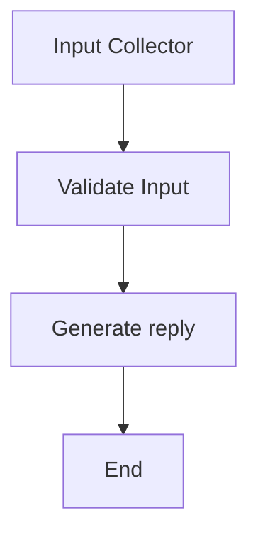

# **Guía de uso: Agente Generador de Descripción de Producto**

Esta carpeta contiene un agente especializado en la generación automática de descripciones de productos para retail, utilizando inteligencia artificial y una interfaz web con Gradio.

https://github.com/user-attachments/assets/d06a1972-f9e8-472a-9134-7711d6089b8a

---
## Estructura de archivos

- **deployment_p_description.py**: Define la interfaz web (Gradio) y la función principal que recibe los datos del usuario, prepara el estado de entrada y ejecuta el grafo de generación.
- **generator_p_description.py**: Contiene la lógica del grafo (LangGraph) y la función de generación de descripciones. Aquí se define el flujo de procesamiento y validación de los datos.
- **test_p_description.py**: Script de prueba para invocar el agente desde código, útil para testing y debugging.
- **__init__.py**: Archivo de inicialización del módulo.


---
## Instrucciones de uso

#### 1. Ejecutar la interfaz web

Desde la raíz del proyecto o desde esta carpeta, ejecuta:

```bash
python deployment_p_description.py
```

Esto levantará una interfaz web en Gradio donde podrás ingresar los datos del producto y obtener la descripción generada.

#### 2. Campos requeridos

- **Tipo de snack**: Selecciona el tipo de producto (barra, cereal, galleta, chips).
- **Ingredientes principales**: Lista de ingredientes destacados.
- **Beneficios nutricionales**: Características saludables del producto.
- **Sabores disponibles**: Sabores en los que se ofrece el producto.
- **Público objetivo**: Puedes seleccionar uno o varios (niños, adultos, deportistas, jóvenes, edad avanzada).
- **Diferenciador clave**: Qué hace único al producto.
- **Alergenos y/o certificaciones**: Información relevante sobre alérgenos o certificaciones.
- **Consulta adicional**: (Opcional) Pregunta o instrucción extra para personalizar la descripción.

#### 3. Pruebas automáticas

Puedes probar el agente sin interfaz ejecutando:

```bash
python test_p_description.py
```

Esto ejecutará un ejemplo de generación y mostrará la descripción resultante en consola.


#### 4. Despliegue

Puedes probar el despliegue del agente, esto te devolvera una API para poder acceder a la interfaz. Ejecuta:

```bash
python deployment_p_description.py
```
[Despliegue completo aqui](https://www.youtube.com/watch?v=KQYl_CPpP1I&t=1s)

https://github.com/user-attachments/assets/c13593a0-e9bf-4f73-93c2-9891ca1c3db1


---
## Workflow




---
## Notas técnicas

- El grafo espera que los datos de entrada usen claves en inglés y con guion bajo (ej: `target_audience`).
- El campo "Público objetivo" puede recibir una lista de valores; la función los convierte a string automáticamente.
- La respuesta generada se encuentra en el campo `messages` del estado de salida.


---
## Dependencias

Instala las dependencias con:

```bash
pip install -r requirements.txt
```


---
## Contacto y soporte

Para dudas o mejoras contactame:  fernandocabrerabrz@gmail.com
